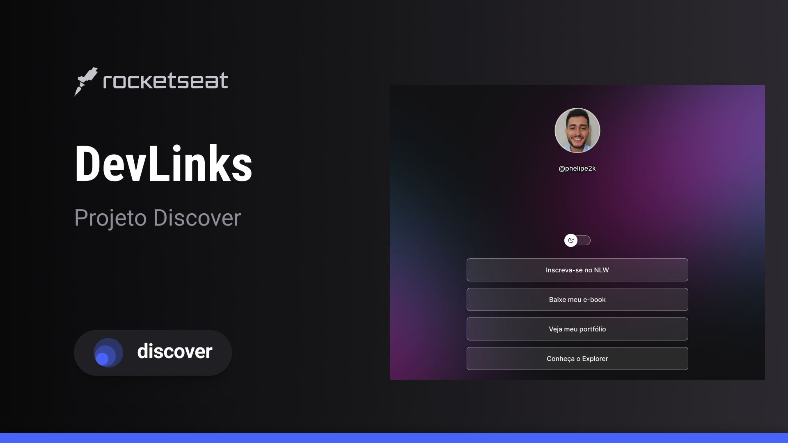

# DevLinks

<p align="center">
  
</p>

Um projeto de perfil com links para redes sociais e modo claro/escuro, desenvolvido como parte de um desafio de frontend.

## 📋 Descrição

O DevLinks é uma página de perfil pessoal que exibe:

- Foto do perfil com alternância entre modo claro e escuro
- Nome de usuário (@phelipe)
- Links para redes sociais (GitHub, LinkedIn, Instagram, Portfólio)
- Ícones sociais com hover effects
- Footer com créditos

O projeto inclui um toggle para alternar entre modo claro e escuro, que muda:

- Cores de texto e fundo
- Imagem do avatar
- Ícones do switch (lua/estrela para modo escuro, sol para modo claro)

## 🛠️ Tecnologias Utilizadas

- HTML5
- CSS3 (com variáveis CSS para temas)
- JavaScript ES6
- [IonIcons](https://ionic.io/ionicons) para ícones
- Fonte [Inter](https://fonts.google.com/specimen/Inter) do Google Fonts
- Figma

## 📁 Estrutura do Projeto

```
DevLinks/
├── index.html
├── script.js
├── style.css
└── assets/
    ├── avatar.png
    ├── avatar-light.png
    ├── bg-desktop.jpg
    ├── bg-desktop-light.jpg
    ├── moon-stars.svg
    └── sun.svg
```

## 🚀 Como Executar

1. Clone este repositório
2. Abra o arquivo `index.html` em seu navegador
3. Clique no botão de toggle para alternar entre modo claro e escuro

## 🎨 Funcionalidades

- **Modo Claro/Escuro**: Alternância completa com troca de imagens e cores
- **Design Responsivo**: Layout adaptado para diferentes tamanhos de tela
- **Efeitos Hover**: Transições suaves em links e ícones sociais
- **Filtrado de Fundo**: Efeito blur nos elementos de superfície
- **Ícones Vetoriais**: Uso de SVGs e IonIcons para gráficos nítidos

## 📱 Responsividade

O projeto é projetado para funcionar bem em:

- Desktop (largura fixa de 360px centralizada)
- Mobile (adaptação através de viewport meta tag)

## 👨‍💻 Autor

**Warley Phelipe**

- [LinkedIn](https://www.linkedin.com/in/warley-phelipe/)
- [Instagram](https://www.instagram.com/warleyphelps/)
- [GitHub](https://github.com/phelipe2k)
- [Portfólio](https://phelipe2k.github.io/portfolio-warley/)

## 📄 Licença

Este projeto está sob a licença MIT. Sinta-se à vontade para usar e modificar conforme necessário.

---

Feito por Warley Phelipe - 2025
